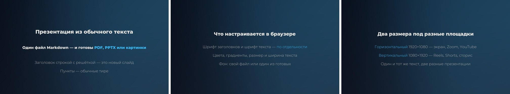
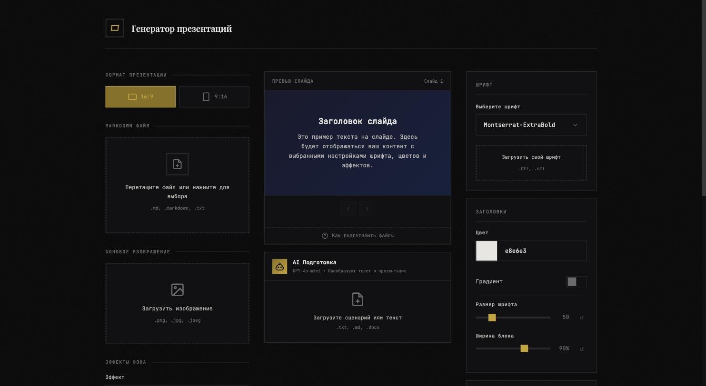

# Slidemaker — презентация из текста

Пишете обычный текст, получаете готовую презентацию: **PDF**, **PowerPoint (PPTX)** или **набор картинок**. Никакого PowerPoint, никакой вёрстки, никакого дизайнера.



Программа открывается в браузере на вашем компьютере. Ничего не отправляется в интернет: файлы обрабатываются локально и никуда не уходят.

- Горизонтальные слайды 1920×1080 — для экрана, Zoom, YouTube
- Вертикальные слайды 1080×1920 — для Reels, Shorts и сторис
- Свои шрифты, цвета, градиенты, фоны

---

## Способ 1. Попросить ИИ всё сделать за вас

Если у вас на компьютере стоит **ИИ-помощник с доступом к вашим файлам и терминалу** — Claude Code, Codex CLI, Cursor, Windsurf, Gemini CLI и подобные — просто скопируйте текст ниже и отправьте ему.

```
Разверни на моём компьютере проект https://github.com/malovnik/slidemaker
Скачай его, поставь всё, что нужно, запусти и открой в браузере.
Инструкция для тебя лежит в файле AGENTS.md внутри репозитория — следуй ей.
Когда всё заработает, скажи мне, по какому адресу открывать.
```

Дальше ждёте. Помощник сам скачает проект, установит нужное и запустит — вам останется открыть браузер.

**Важно, чтобы не потерять время.** Обычный чат в браузере (ChatGPT на сайте, Claude на сайте, DeepSeek на сайте) так сделать **не сможет** — у него нет доступа к вашему компьютеру. Ему нечем скачивать файлы и запускать программы. Нужен именно помощник, установленный на компьютер, — он работает в чёрном окне терминала и умеет выполнять команды.

Если такого помощника нет или он запутался — переходите к способу 2. Там всё то же самое, но руками, и это не страшно.

---

## Способ 2. Сделать руками. Полная инструкция

Здесь придётся работать в **терминале** — это окно, куда печатают команды текстом. Ничего сложного: вы копируете строку, вставляете, нажимаете Enter.

Как открыть терминал:

- **macOS**: нажмите `Cmd + Пробел`, наберите `Терминал` (или `Terminal`), Enter.
- **Windows**: нажмите `Win`, наберите `PowerShell`, Enter.

### Шаг 1. Поставьте Python

Python — это язык, на котором написана программа. Без него ничего не запустится.

Проверьте, есть ли он уже. Вставьте в терминал и нажмите Enter:

```bash
python3 --version
```

Если в ответ появилось что-то вроде `Python 3.11.9` — Python есть, идите к шагу 2.

Если ответ похож на «command not found» или «не является внутренней или внешней командой» — скачайте Python с сайта [python.org/downloads](https://www.python.org/downloads/) и установите.

- Нужна версия **3.9 или новее**.
- **Пользователям Windows важно**: в первом окне установщика поставьте галочку **«Add python.exe to PATH»**. Без неё команды ниже работать не будут.
- После установки закройте терминал и откройте заново.

### Шаг 2. Скачайте программу

Способ А, через `git` (если он у вас есть):

```bash
git clone https://github.com/malovnik/slidemaker.git
cd slidemaker
```

Способ Б, без `git`: откройте [страницу проекта](https://github.com/malovnik/slidemaker), нажмите зелёную кнопку **Code**, затем **Download ZIP**. Распакуйте архив, например в папку «Документы». Затем в терминале перейдите в распакованную папку:

```bash
cd ~/Documents/slidemaker-main
```

Строка `cd` означает «перейти в папку». Если путь другой — впишите свой. Подсказка: наберите `cd `, а затем перетащите папку мышкой прямо в окно терминала — путь подставится сам.

### Шаг 3. Установите то, что нужно программе

**macOS и Linux:**

```bash
python3 -m venv .venv
source .venv/bin/activate
pip install -r requirements.txt
```

**Windows (PowerShell):**

```powershell
python -m venv .venv
.venv\Scripts\Activate.ps1
pip install -r requirements.txt
```

Первая строка создаёт отдельную «коробку» для библиотек, чтобы не засорять систему. Вторая эту коробку включает. Третья скачивает библиотеки — займёт минуту-две, побегут строчки, это нормально.

Если Windows ругается на запуск скриптов, выполните один раз:

```powershell
Set-ExecutionPolicy -Scope Process -ExecutionPolicy Bypass
```

и повторите строку с `Activate.ps1`.

### Шаг 4. Запустите

```bash
python main.py
```

В терминале появится адрес — обычно `http://127.0.0.1:5000`. Браузер откроется сам; если нет, скопируйте адрес в адресную строку браузера вручную.

Готово. Терминал при работе программы **должен оставаться открытым** — это и есть работающая программа. Чтобы остановить, вернитесь в терминал и нажмите `Ctrl + C`.

Чтобы запустить программу в следующий раз, нужны только две команды: перейти в папку (`cd ...`), включить коробку (`source .venv/bin/activate` или `.venv\Scripts\Activate.ps1`) и запустить (`python main.py`).

---

## Как пользоваться



### Текст презентации

Презентация пишется в обычном текстовом файле с расширением `.md` (можно и `.txt`). Правил всего три:

```markdown
# Заголовок первого слайда

- Первый пункт
- Второй пункт с **выделенным** словом
- Третий пункт

# Заголовок второго слайда

- Каждая решётка начинает новый слайд
```

- Строка, начатая с `#` — новый слайд и его заголовок.
- Строка, начатая с `-` — пункт на слайде.
- Слово между `**двумя звёздочками**` красится акцентным цветом.

Готовый образец лежит в файле `example.md` — откройте его в «Блокноте» или «TextEdit», замените текст своим, сохраните и загрузите в программу.

Не хотите писать сами — попросите любой ИИ: «Сделай из этого текста markdown для презентации: каждый смысловой блок — заголовок со знаком #, под ним 2–4 пункта через дефис, ключевые слова выдели двумя звёздочками».

### В браузере

1. Выберите формат — 16:9 (горизонтально) или 9:16 (вертикально).
2. Перетащите свой `.md` файл в левое окно.
3. При желании загрузите свой фон — картинку `.jpg` или `.png`. Пять готовых фонов лежат в папке `backgrounds`.
4. Настройте справа шрифты, цвета, размеры. Превью в центре обновляется сразу.
5. Выберите формат выгрузки — PDF, PPTX или JPG — и нажмите «Сгенерировать».

### Что выбрать: PDF, PPTX или JPG

- **PDF** — показывать с экрана, отправлять, печатать. Выглядит везде одинаково.
- **PPTX** — открывается в PowerPoint и Google Slides, слайды можно дальше править руками.
- **JPG** — архив с картинками: для соцсетей, каруселей, сторис. Для этого формата нужна дополнительная программа (см. ниже).

---

## Необязательные дополнения

### Экспорт в картинки (JPG)

Нужна утилита **Poppler**. PDF и PPTX работают и без неё.

- macOS: `brew install poppler` (если нет `brew`, поставьте с [brew.sh](https://brew.sh))
- Linux: `sudo apt install poppler-utils`
- Windows: скачайте [сборку Poppler](https://github.com/oschwartz10612/poppler-windows/releases), распакуйте и добавьте папку `bin` в переменную PATH

### Кнопка «AI Подготовка»

Превращает сырой текст (в том числе `.docx`) в готовый markdown для слайдов. Работает через OpenAI и требует ваш ключ. Без ключа кнопка просто не работает, остальное работает.

Скопируйте файл `.env.example` в `.env` и впишите ключ в строку `OPENAI_API_KEY=`. Ключ берётся в личном кабинете OpenAI и стоит денег по факту использования — обычно копейки за текст.

---

## Если что-то пошло не так

| Что видите | Что делать |
|---|---|
| `command not found: python3` | Python не установлен или Windows-галочка «Add to PATH» не поставлена. Вернитесь к шагу 1 |
| `No module named flask` | Не включена «коробка» с библиотеками. Выполните `source .venv/bin/activate` (Windows: `.venv\Scripts\Activate.ps1`) и повторите |
| `Address already in use` | Порт занят другой программой. Запустите так: `PORT=5001 python main.py` (Windows: `$env:PORT=5001; python main.py`) |
| Страница не открывается | Проверьте, что терминал с программой ещё открыт и в нём нет красных ошибок |
| При экспорте в JPG ошибка | Не установлен Poppler — см. раздел выше. PDF и PPTX работают без него |
| Кириллица в презентации «квадратиками» | Загруженный вами шрифт не содержит русских букв. Возьмите другой или оставьте Montserrat |
| Всё сломалось непонятно как | Удалите папку `.venv` и повторите шаг 3 с начала |

Не помогло — откройте [issue в репозитории](https://github.com/malovnik/slidemaker/issues) и приложите текст ошибки из терминала целиком.

---

## Выложить в интернет

Проект готов к развёртыванию на [Railway](https://railway.app) — файлы `Procfile`, `railway.json` и `nixpacks.toml` уже настроены.

Если выкладываете в интернет, обязательно задайте две переменные окружения:

- `PIN_CODE` — пин-код на вход. **Пока он не задан, вход свободный**: это удобно на своём компьютере и опасно в интернете, потому что генерировать презентации сможет любой, кто знает адрес.
- `SECRET_KEY` — длинная случайная строка для подписи сессий. Без неё при каждом перезапуске всех будет выкидывать из сессии.

---

## Что внутри

```
main.py              запуск на своём компьютере
wsgi.py              запуск на сервере
md_to_slides.py      ядро: превращает markdown в PDF, PPTX и картинки
web/                 веб-интерфейс (Flask)
fonts/               шрифты Montserrat
backgrounds/         пять готовых фонов
tools/               скрипт, который эти фоны рисует
example.md           образец презентации
AGENTS.md            инструкция для ИИ-помощника
```

Python 3.9+, Flask, ReportLab (PDF), python-pptx (PPTX), Pillow, pdf2image (JPG).

## Лицензии

Код — MIT, файл [LICENSE](LICENSE). Делайте с ним что хотите.

Шрифты Montserrat — SIL Open Font License 1.1, файл [fonts/OFL.txt](fonts/OFL.txt). Фоны в папке `backgrounds` нарисованы скриптом `tools/make_backgrounds.py` и свободны от чужих прав.

Всё, что вы загрузите сами — шрифты, фоны, тексты — остаётся вашей зоной ответственности.
